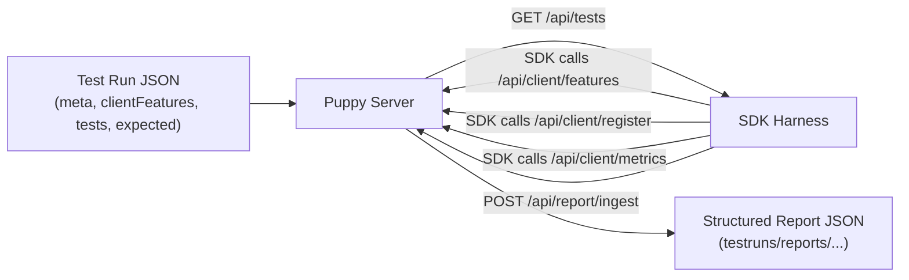

# Puppy

Puppy is a portable tool for analyzing and asserting Unleash SDK behavior.

A process affectionately referred to by myself as "Poking it with a stick."
<p align="center">
    
</p>

## Purpose
Puppy validates externally observable SDK behavior.

This project acts as a practical Hyrum's Law shield: instead of asserting SDK internals, it asserts what an SDK actually does on the wire and through its public behavior.

Puppy does this by:
- pretending to be an Unleash server,
- wrapping an SDK in a harness,
- driving the harness through explicit test-run steps,
- monitoring SDK API traffic (features polling, registration, metrics), and
- combining observed server-side behavior with harness-reported operation results into a structured report.

## Architecture


## Harness + Server Model
- Test runs are defined in one JSON file (example: `examples/basic-test-run.json`).
- `clientFeatures` can be a sequence:
  - first poll gets index `0`,
  - second poll gets index `1`,
  - when exhausted, Puppy keeps serving the last item.
- `/api/client/features` emits ETags and handles conditional requests (`If-None-Match` -> `304`).
- Harness operations currently include:
  - `isEnabled`
  - `getVariant`
  - `sleep`
- Puppy persists a structured report containing:
  - harness results,
  - features poll trace,
  - registrations,
  - metrics,
  - aggregated toggle totals,
  - assertion outcomes.

## Quickstart
Prereqs:
- Docker
- bash
- jq (optional, for inspecting JSON)

Start Puppy with a test-run file:
```sh
./run-puppy-server.sh examples/basic-test-run.json
```

Run a harness (example: Ruby):
```sh
./run-test.sh ruby ./testfile.json
```

Inspect generated reports:
- `testruns/reports/*.json`

## Future Plans
- Forward SDK calls to a real Unleash instance and validate Unleash acceptance of SDK requests.
- Expand rollout across additional SDKs.
- Extend the same behavior-driven model to Edge.
